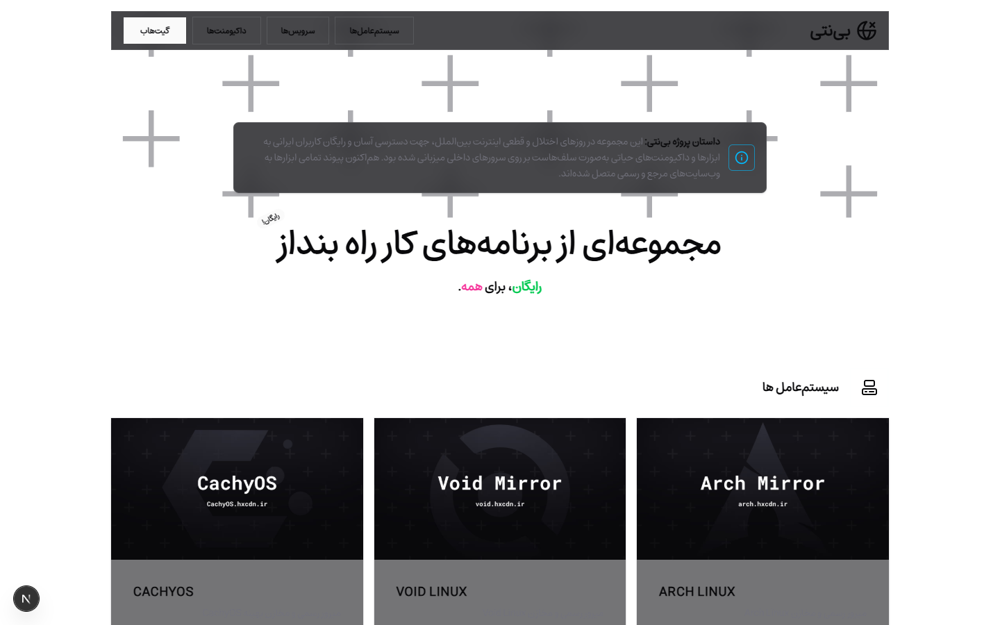

<div align="center">

# 🌐 بی‌نتی (Bi Neti)
### مجموعه‌ای از برنامه‌ها، سرویس‌ها و مستندات کار‌راه‌انداز برای روزهای سخت

[](https://nextjs.org/)
[](https://react.dev/)
[](https://www.typescriptlang.org/)
[](https://tailwindcss.com/)
[](LICENSE)
[](https://github.com/danialzaree)

<br/>



</div>

---

## 📖 درباره پروژه

پروژه **بی‌نتی (Bi Neti)** در روزهای اختلال و قطعی اینترنت بین‌الملل در ایران با هدف فراهم آوردن دسترسی آزاد، سریع و بدون دغدغه برای برنامه‌نویسان، فعالان IT و کاربران ایرانی به ابزارها، داکیومنت‌ها و مخازن حیاتی لینوکس توسعه داده شد.

در آن دوره، ابزارها و مستندات محبوب متن‌باز بر روی سرورهای داخلی به‌صورت سلف‌هاست (Self-Hosted) میزبانی شده بودند. هم‌اکنون این پروژه به عنوان یک هاب مرجع و منسجم، تمامی پیوندها را به مراجع اصلی و وب‌سایت‌های رسمی متصل کرده تا همواره در دسترس همگان باشد.

---

## ✨ بخش‌ها و امکانات پروژه

### 🖥️ ۱. راهنما و میرور سیستم‌عامل‌ها (OS Mirrors)
دستورالعمل‌ها و پیکربندی‌های سریع برای تنظیم مخازن رسمی توزیع‌های پرکاربرد لینوکس:
- **Arch Linux:** راهنمای استفاده از مخازن GeoDNS رسمی
- **CachyOS:** راهنمای مخازن رسمی و بهینه‌سازی‌شده برای x86-64-v3 و v4
- **Void Linux:** راهنمای تنظیم مخزن رسمی از طریق ابزار `xmirror` و دستی

### 🛠️ ۲. سرویس‌ها و ابزارهای وب (Web Applications)
مجموعه‌ای از ابزارهای آنلاین و کارآمد بدون نیاز به نصب:
- **Excalidraw:** وایت‌برد و رسم دیاگرام با حس دست‌نویس
- **BentoPDF:** ابزارهای جامع مدیریت و تبدیل PDF
- **VERT:** ابزار تبدیل فرمت‌های فایل در محیط مرورگر (WASM)
- **MonkeyType:** تست و تمرین سرعت تایپ
- **Moodist:** صداهای محیطی برای تمرکز و آرامش
- **Screego:** اشتراک‌گذاری امن و سریع صفحه نمایش
- **DrawIO:** رسم انواع دیاگرام‌ها و فلوچارت‌های مهندسی
- **Icones:** دسترسی به هزاران آیکون وکتور
- **IT Tools:** مجموعه ابزارهای دم‌دستی برنامه‌نویسی و شبکه
- **CyberChef:** تحلیل داده‌ها، رمزنگاری و کدگذاری
- **EchoIP:** دریافت و بررسی اطلاعات آدرس IP

### 📚 ۳. مستندات و داکیومنتیشن‌ها (Documentation Hub)
دسترسی به راهنماها و مراجع رسمی فناوری‌های روز وب:
- **Tailwind CSS**, **Astro**, **Base UI**, **Open WebUI**, **Expo**, **T3 Stack**, **Drizzle ORM**, **ElysiaJS**, **shadcn/ui**, **Vue.js**, **Hono**, **MDN Web Docs**, **DevDocs**, **Wikipedia**, **W3Schools**

### 🤝 ۴. وب‌سایت‌ها و پلتفرم‌های همکار (Similar Projects)
معرفی پلتفرم‌های جامعه متن‌باز و ابزارهای مشابه شامل:
- **Bazitory**, **DevNeeds**, **Bokhary**, **Scorpian**

---

## 🛠️ تکنولوژی‌های به‌کار رفته

- **فریمورک:** [Next.js 16](https://nextjs.org/) (App Router & Turbopack)
- **کتابخانه UI:** [React 19](https://react.dev/)
- **زبان:** [TypeScript](https://www.typescriptlang.org/)
- **استایل‌دهی:** [Tailwind CSS v4](https://tailwindcss.com/)
- **مجموعه آیکون:** [Lucide React](https://lucide.dev/)
- **فونت فارسی:** آذر‌مهر (AzarMehr) با لود بهینه

---

## 🚀 راه‌اندازی و اجرای محلی

۱. **کلون کردن مخزن:**
```bash
git clone https://github.com/danialzaree/bineti.git
cd bineti
```

۲. **نصب وابستگی‌ها:**
```bash
npm install
```

۳. **اجرای نسخه توسعه:**
```bash
npm run dev
```
سایت در آدرس [http://localhost:3000](http://localhost:3000) قابل مشاهده خواهد بود.

۴. **تولید خروجی استاتیک (Production Build):**
```bash
npm run build
```
خروجی استاتیک سازگار با تمامی وب‌سرورها (Nginx، Apache، Liara و GitHub Pages) در پوشه `out/` تولید می‌شود.

---

## 👨‍💻 توسعه‌دهنده و سازنده

- **دانیال زارع (Danial Zaree)**
  - گیت‌هاب: [@danialzaree](https://github.com/danialzaree)
  - تلگرام: [@danialzaree0](https://t.me/danialzaree0)

---

## 📄 لایسنس

این پروژه تحت لایسنس [MIT](LICENSE) منتشر شده است و استفاده از آن کاملاً آزاد و رایگان می‌باشد.

